# tesco-mlops-azure

**Production-grade Azure MLOps platform for Tesco customer segmentation and propensity modelling** — real-time Event Hub ingestion, medallion Delta Lake, Databricks ML pipelines, MLflow model registry, FastAPI scoring on AKS, PSI drift detection, and fully automated CI/CD.


---

## Architecture

```mermaid
flowchart LR
    subgraph Ingestion
        EP[Event Producer\nsend_event.py]
        EH[Azure Event Hubs\ntransactions topic]
        DS[Databricks\nStructured Streaming\n01_ingest.py]
    end

    subgraph ADLS["ADLS Gen2 — Medallion Architecture"]
        BR[(Bronze\nraw Delta\npartitioned by date)]
        SL[(Silver\nRFM + behavioural\nfeatures Delta)]
        GD[(Gold\nsegments +\npropensity scores)]
    end

    subgraph ML["Databricks ML Cluster"]
        FE[Feature Engineering\n02_feature_engineering.py]
        KM[KMeans Segmentation\n03_train_segmentation.py]
        LG[LightGBM Propensity\n04_propensity_model.py]
    end

    subgraph Registry
        MR[MLflow Model Registry\nProduction stage]
    end

    subgraph Deploy["Deployment Pipeline"]
        GA[GitHub Actions\nCI/CD]
        ACR[Azure Container Registry\nPremium SKU]
        AKS[AKS Cluster\nmlops namespace]
        API[FastAPI\n/predict /health /ready]
        AI[Application Insights\nlatency + errors]
    end

    EP -->|async batch| EH
    EH -->|Spark EventHub connector| DS
    DS -->|append| BR
    BR --> FE
    FE -->|overwrite| SL
    SL --> KM
    SL --> LG
    KM -->|segment labels| GD
    LG -->|propensity scores| GD
    KM -->|log_model| MR
    LG -->|log_model| MR
    MR -->|trigger on push| GA
    GA -->|docker push| ACR
    ACR -->|image pull| AKS
    AKS -->|serves| API
    API -->|telemetry| AI
```



---

## Tech Stack

| Layer | Technology | Purpose |
|---|---|---|
| **Ingestion** | Azure Event Hubs (Standard, 4 partitions) | Real-time transaction streaming from POS and online channels |
| **Data Lake** | ADLS Gen2 (HNS, GRS) — Delta Lake | Medallion architecture: bronze (raw) → silver (features) → gold (outputs) |
| **Compute** | Azure Databricks (Premium SKU) | PySpark structured streaming, distributed feature engineering |
| **ML — Segmentation** | scikit-learn KMeans + StandardScaler pipeline | Unsupervised customer segmentation on RFM features |
| **ML — Propensity** | LightGBM (GBDT binary classifier) | Per-category purchase propensity scores with early stopping |
| **Experiment Tracking** | MLflow (Databricks-managed) | Metrics, artefacts, model versioning, stage promotion |
| **Drift Detection** | Population Stability Index (PSI) | Weekly feature drift monitoring; auto-triggers retraining at PSI > 0.2 |
| **Orchestration** | Apache Airflow 2.9 + Databricks provider | Daily training DAG, weekly batch scoring DAG, drift → retraining branch |
| **Serving** | FastAPI 0.115 + uvicorn on AKS | Low-latency `/predict` with Pydantic validation, `/health`, `/ready` probes |
| **Containers** | Azure Container Registry (Premium SKU) | Geo-replicated image store with private endpoint support |
| **Secrets** | Azure Key Vault (purge-protected) | Connection strings, storage account name, tokens — never in code |
| **Infrastructure** | Terraform ≥ 1.5 (AzureRM + Databricks providers) | Fully reproducible IaC with remote state in Azure Blob |
| **CI/CD** | GitHub Actions (4-job pipeline) | Lint → test → build → AKS deploy → Databricks training trigger |
| **Analytics / BI** | Azure Synapse Analytics + Power BI | Gold layer SQL query layer; customer segment distribution and propensity score dashboards for merchandising and marketing teams |
| **Monitoring** | Azure Application Insights | API latency, error rate, throughput; Databricks job alerts |
| **Testing** | pytest + httpx AsyncClient | 28 unit tests: feature engineering invariants + FastAPI contract tests |

---

## Key Design Decisions

Each decision below addresses a specific production failure mode. The original design contained 13 architectural bugs; all are resolved in this implementation.

### Infrastructure

**1. `azurerm_databricks_workspace` replaces `databricks_mws_workspaces`**
The MWS (Multi-Workspace Setup) resource is a Databricks-internal construct for SaaS account management and has no valid use here. Using it causes `terraform apply` to fail immediately. `azurerm_databricks_workspace` is the correct AzureRM-native resource and integrates cleanly with the rest of the Azure resource graph.

**2. Silver and gold storage containers added (bronze-only was incomplete)**
A bronze-only lake means feature engineering and model outputs have nowhere to land. The full medallion pattern — bronze (raw), silver (cleaned features), gold (model outputs) — is the standard for separating ingestion concerns from ML concerns and enables independent retention policies and access control per layer.

**3. ACR SKU upgraded from Basic to Premium**
ACR Basic has a 10 GiB storage cap, no geo-replication, and no private endpoint support. In a production deployment connecting to AKS via a private virtual network, Basic ACR cannot be reached without public internet exposure. Premium enables private endpoints, customer-managed keys, and geo-redundant image storage — all mandatory for enterprise workloads.

**4. Azure Key Vault added (was missing entirely)**
The original design stored connection strings directly in Databricks notebook code and Terraform outputs as plaintext. Key Vault is the Azure-native secrets store: it provides access policies, audit logging, soft-delete with purge protection, and serves as the single source of truth for all secrets consumed by Databricks (via secret scope), AML, and AKS (via CSI driver or K8s secrets).

**5. `sensitive = true` on `eventhub_connection_string` output**
Without this flag, `terraform plan` and `terraform apply` print the full SAS connection string to stdout, which flows into CI/CD logs and is retained indefinitely. Marking the output sensitive suppresses it from all Terraform console output while keeping it accessible programmatically via `terraform output -json`.

### Databricks Notebooks

**6. All `<STORAGE_ACCOUNT>` placeholders replaced with `dbutils.secrets.get()`**
Hardcoded placeholder strings cause runtime `AnalysisException` the moment Spark tries to resolve the ADLS path. More critically, hardcoding a real storage account name in notebook source means it gets committed to version control and exposed to anyone with repo access. `dbutils.secrets.get(scope='adls-scope', key='STORAGE_ACCOUNT')` retrieves the value at runtime from Key Vault-backed Databricks secret scope, keeping credentials out of source.

### Serving API

**7. Flask replaced with FastAPI + uvicorn**
Flask is synchronous and single-threaded by default — under concurrent scoring requests it serialises work through the GIL and quickly saturates on a single core. FastAPI is async-native, supports concurrent request handling via uvicorn's event loop, provides automatic OpenAPI documentation, and enforces request/response schemas via Pydantic. The addition of `/health` and `/ready` endpoints is required for Kubernetes liveness and readiness probes — without them AKS cannot distinguish a starting pod from a crashed one.

**8. `flask` and `gunicorn` removed; `fastapi`, `uvicorn[standard]`, `httpx` added**
Keeping Flask in `requirements.txt` alongside FastAPI creates a conflicting dependency surface and imports an unused 15 MB package into the container. `httpx` replaces `requests` as the async-compatible HTTP client used in tests and health checks. `uvicorn[standard]` pulls in `uvloop` and `httptools` for maximum throughput.

**9. Dockerfile CMD updated to uvicorn**
A gunicorn CMD with a Flask app would fail immediately at container startup since `score.py` no longer exports a WSGI callable — it exports an ASGI app. The uvicorn CMD also allows worker count to be tuned independently of the image, delegating horizontal scaling to the AKS HPA rather than baking it into the process model.

### Kubernetes

**10. `MLFLOW_TRACKING_URI` env var injected from K8s Secret**
Without this variable, `mlflow.set_tracking_uri()` defaults to the local filesystem, meaning the scoring service loads a model from a path that does not exist inside the container. Injecting it from a K8s Secret (not a ConfigMap) ensures the Databricks workspace URL is available at pod startup, never appears in YAML committed to the repo, and can be rotated without rebuilding the image.

**11. `kubectl apply -f k8s/service.yaml` added to deploy job**
The original CI/CD deployed the `Deployment` object but never applied the `Service`. Without a Service, the AKS pods are unreachable — no ClusterIP is allocated, no load balancer is provisioned, and the smoke test at the end of the deploy job would hang indefinitely waiting for an IP that never arrives.

### CI/CD

**12. Databricks CLI job trigger step added**
The original pipeline deployed a new container image but never signalled Databricks to retrain the model against it. Without this step, a code change that affects feature engineering or model hyperparameters is deployed to the scoring service but the production model in the registry remains stale. The trigger step calls `databricks jobs run-now` and logs the resulting `run_id` for traceability.

**13. `.github/workflows/` placed at repo root**
GitHub Actions only discovers workflow files at `.github/workflows/` relative to the **repository root**. A workflow file at `ci/github/workflows/ci-cd.yml` is silently ignored — no pipelines run, no error is raised, and pushes to `main` deploy nothing. This is one of the most common silent failures in new MLOps repos.

---

## Quickstart

### Prerequisites

```bash
az --version        # Azure CLI >= 2.55
terraform --version # >= 1.5
databricks --version # pip install databricks-cli
kubectl version     # >= 1.28
docker --version
```

### 1. Bootstrap Azure Infrastructure

```bash
cd infra/terraform

# One-time: create Terraform remote state backend
az group create -n tesco-mlops-tfstate-rg -l uksouth
az storage account create -n tescomlopstfstate \
    -g tesco-mlops-tfstate-rg --sku Standard_LRS
az storage container create -n tfstate \
    --account-name tescomlopstfstate

# Copy and populate environment-specific values
cp terraform.tfvars.example terraform.tfvars
# Edit terraform.tfvars: fill in subscription_id, tenant_id, deployer_object_id

# Deploy all resources (~8 min)
terraform init
terraform plan \
    -var="subscription_id=$(az account show --query id -o tsv)" \
    -var="tenant_id=$(az account show --query tenantId -o tsv)" \
    -var="deployer_object_id=$(az ad signed-in-user show --query id -o tsv)" \
    -out=tfplan
terraform apply tfplan
```

### 2. Configure Databricks Secret Scope

```bash
# Retrieve outputs from Terraform
SA_NAME=$(terraform output -raw datalake_storage_account_name)
EH_CS=$(terraform output -raw eventhub_connection_string)   # sensitive
DBX_URL=$(terraform output -raw databricks_workspace_url)

# Create secret scope backed by Key Vault
databricks secrets create-scope --scope adls-scope

# Populate secrets consumed by all notebooks
databricks secrets put --scope adls-scope \
    --key STORAGE_ACCOUNT --string-value "$SA_NAME"
databricks secrets put --scope adls-scope \
    --key EVENTHUB_CONNECTION_STRING --string-value "$EH_CS"
```

### 3. Upload Notebooks and Register the Pipeline Job

```bash
# Upload all four notebooks to the Databricks workspace
for nb in databricks/notebooks/*.py; do
    name=$(basename "$nb" .py)
    databricks workspace import \
        --language PYTHON --overwrite \
        "$nb" "/Shared/tesco-mlops/${name}"
done

# Also upload the drift detector
databricks workspace import \
    --language PYTHON --overwrite \
    monitoring/drift_detector.py \
    /Shared/tesco-mlops/drift_detector

# Register the multi-task job
databricks jobs create --json @databricks/jobs/run_job.json
```

### 4. Set GitHub Actions Secrets

Navigate to **Settings → Secrets and variables → Actions** in your fork and add:

| Secret | How to obtain |
|---|---|
| `AZURE_CREDENTIALS` | `az ad sp create-for-rbac --name tesco-mlops-ci --sdk-auth --role Contributor` |
| `DATABRICKS_HOST` | `terraform output -raw databricks_workspace_url` |
| `DATABRICKS_TOKEN` | Generate in Databricks UI: User Settings → Developer → Access Tokens |

### 5. Deploy and Test the Scoring Endpoint

```bash
# Trigger full CI/CD pipeline (push to main or via UI)
git push origin main

# Wait for rollout, then get the service IP
SVC_IP=$(kubectl get svc tesco-mlops-scoring \
    -n mlops -o jsonpath='{.status.loadBalancer.ingress[0].ip}')

# Liveness probe
curl -s "http://${SVC_IP}/health"
# → {"status":"ok"}

# Readiness probe (confirms model is loaded)
curl -s "http://${SVC_IP}/ready"
# → {"status":"ready","model":"tesco-customer-segmentation","stage":"Production"}

# Score a customer
curl -s -X POST "http://${SVC_IP}/predict" \
    -H "Content-Type: application/json" \
    -d '{
      "customers": [{
        "customer_id":     "CUST-0042",
        "recency_days":    14.0,
        "frequency":       28.0,
        "monetary":        412.50,
        "avg_basket_size": 14.73,
        "basket_std":      4.20,
        "online_ratio":    0.65,
        "online_txns":     18.0,
        "instore_txns":    10.0,
        "active_days":     22.0
      }]
    }'
# → {"predictions":[{"customer_id":"CUST-0042","segment_id":2}],
#    "model_name":"tesco-customer-segmentation","model_stage":"Production"}
```

### 6. Run the Test Suite Locally

```bash
pip install -r ml/requirements.txt pytest pytest-asyncio anyio httpx
pytest tests/unit/ -v --tb=short
# 25 tests, ~4s
```

---

## Project Structure

```
tesco-mlops-azure/
├── .github/
│   └── workflows/
│       └── ci-cd.yml               # 4-job pipeline: test→build→deploy→trigger
├── airflow/
│   ├── dags/
│   │   ├── tesco_ml_pipeline.py    # Daily training + weekly drift branch DAG
│   │   └── tesco_batch_scoring.py  # Weekly batch scoring DAG
│   └── requirements.txt
├── databricks/
│   ├── notebooks/
│   │   ├── 01_ingest.py            # Event Hub → bronze Delta (streaming)
│   │   ├── 02_feature_engineering.py  # bronze → silver RFM features
│   │   ├── 03_train_segmentation.py   # KMeans + MLflow logging
│   │   └── 04_propensity_model.py     # LightGBM propensity + MLflow
│   └── jobs/
│       └── run_job.json            # Databricks Jobs API multi-task definition
├── docs/
│   ├── architecture.md             # Component inventory + security posture
│   ├── architecture_diagram.md     # Three Mermaid diagrams
│   └── runbook.md                  # Bootstrap, deploy, promote-model runbook
├── infra/
│   └── terraform/
│       ├── main.tf                 # All Azure resources
│       ├── variables.tf
│       ├── outputs.tf              # sensitive = true on connection strings
│       └── providers.tf
├── k8s/
│   ├── deployment.yaml             # AKS Deployment + HPA (2→10 replicas)
│   └── service.yaml                # Internal Azure LoadBalancer + namespace
├── ml/
│   ├── Dockerfile                  # uvicorn, non-root user, HEALTHCHECK
│   ├── MLproject                   # mlflow run entry-point
│   ├── requirements.txt            # fastapi, uvicorn[standard], lightgbm, mlflow
│   ├── score.py                    # FastAPI: /health /ready /predict
│   └── train.py                    # Local training entry-point
├── monitoring/
│   └── drift_detector.py           # PSI drift detection → auto-retraining
├── producer/
│   └── send_event.py               # Async synthetic Event Hub producer
├── tests/
│   ├── conftest.py                 # Shared fixtures: synthetic data, mock model
│   └── unit/
│       ├── test_feature_engineering.py  # 12 tests: RFM invariants, null handling
│       └── test_score_api.py            # 13 tests: FastAPI contract + error paths
├── CLAUDE.md
├── pytest.ini
└── README.md
```

---

## Author

**Debabrata Mishra** — Senior ML Engineer  
[](https://www.linkedin.com/in/debabrata-mishra/)

**Publication:** *Neural Document Quality Estimation for Information Retrieval Re-ranking* — SIGIR 2024  
DOI: [10.1145/3626772.3657765](https://doi.org/10.1145/3626772.3657765)
