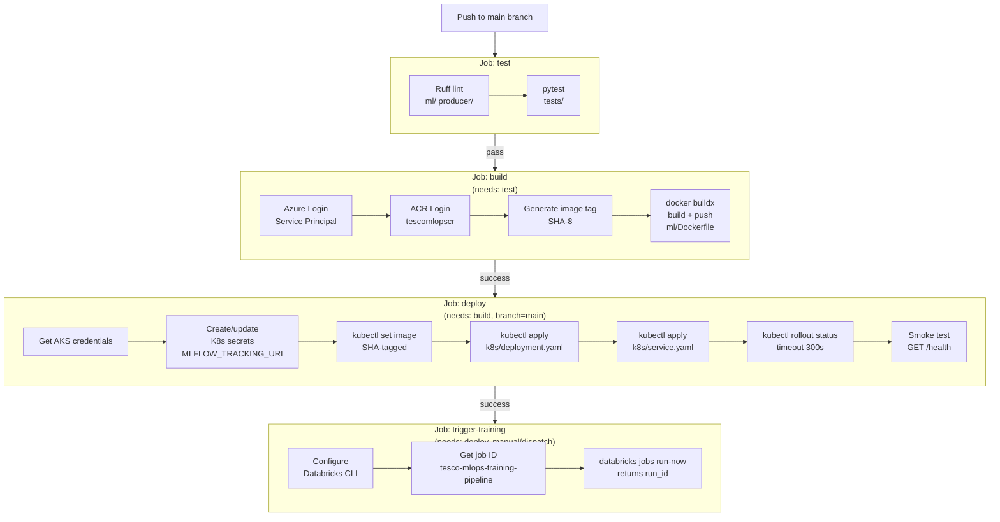
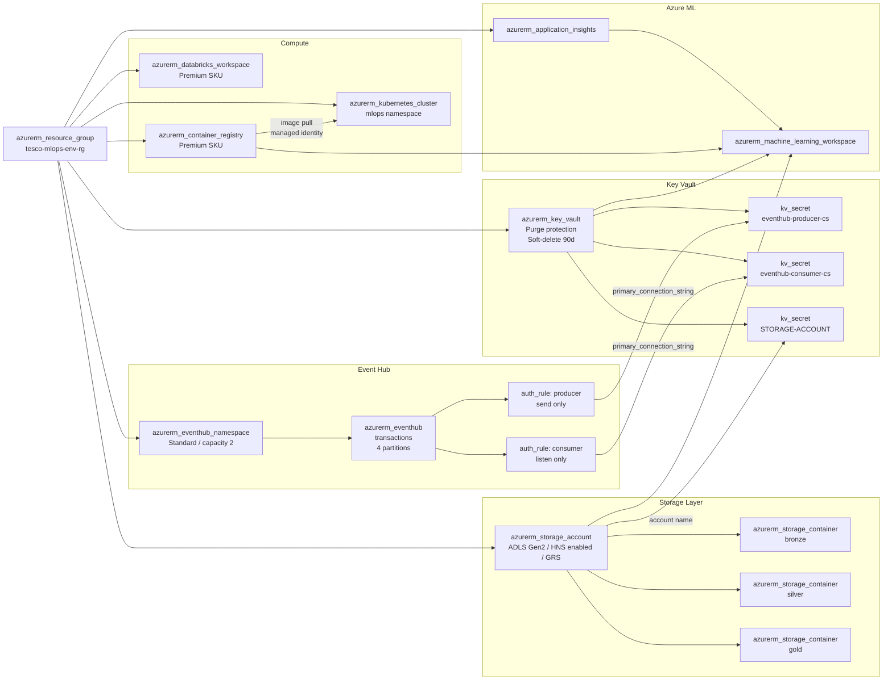

# Architecture Diagrams — Tesco MLOps Azure

## 1. End-to-End Data and ML Pipeline

```mermaid
flowchart LR
    subgraph Ingestion
        EP[Event Producer\nsend_event.py]
        EH[Azure Event Hubs\ntransactions topic]
        DS[Databricks\nStructured Streaming\n01_ingest.py]
    end

    subgraph ADLS["ADLS Gen2 — Medallion Architecture"]
        BR[(Bronze\nraw Delta\npartitioned by date)]
        SL[(Silver\nRFM + behavioural\nfeatures Delta)]
        GD[(Gold\nsegments +\npropensity scores)]
    end

    subgraph ML["Databricks ML Cluster"]
        FE[Feature Engineering\n02_feature_engineering.py]
        KM[KMeans Segmentation\n03_train_segmentation.py]
        LG[LightGBM Propensity\n04_propensity_model.py]
    end

    subgraph Registry
        MR[MLflow Model Registry\nProduction stage]
    end

    subgraph Deploy["Deployment Pipeline"]
        GA[GitHub Actions\nCI/CD]
        ACR[Azure Container Registry\nPremium SKU]
        AKS[AKS Cluster\nmlops namespace]
        API[FastAPI\n/predict /health /ready]
        AI[Application Insights\nlatency + errors]
    end

    EP -->|async batch| EH
    EH -->|Spark EventHub connector| DS
    DS -->|append| BR
    BR --> FE
    FE -->|overwrite| SL
    SL --> KM
    SL --> LG
    KM -->|segment labels| GD
    LG -->|propensity scores| GD
    KM -->|log_model| MR
    LG -->|log_model| MR
    MR -->|trigger on push| GA
    GA -->|docker push| ACR
    ACR -->|image pull| AKS
    AKS -->|serves| API
    API -->|telemetry| AI
```

---

## 2. CI/CD Pipeline Flow

```mermaid
flowchart TD
    PH[Push to main branch]

    subgraph test["Job: test"]
        LN[Ruff lint\nml/ producer/]
        UT[pytest\ntests/]
        LN --> UT
    end

    subgraph build["Job: build\n(needs: test)"]
        AZL[Azure Login\nService Principal]
        ACL[ACR Login\ntescomlopscr]
        MT[Generate image tag\nSHA-8]
        BP[docker buildx\nbuild + push\nml/Dockerfile]
        AZL --> ACL --> MT --> BP
    end

    subgraph deploy["Job: deploy\n(needs: build, branch=main)"]
        AKC[Get AKS credentials]
        KS[Create/update\nK8s secrets\nMLFLOW_TRACKING_URI]
        SI[kubectl set image\nSHA-tagged]
        AD[kubectl apply\nk8s/deployment.yaml]
        SV[kubectl apply\nk8s/service.yaml]
        RO[kubectl rollout status\ntimeout 300s]
        SK[Smoke test\nGET /health]
        AKC --> KS --> SI --> AD --> SV --> RO --> SK
    end

    subgraph trigger["Job: trigger-training\n(needs: deploy, manual/dispatch)"]
        DC[Configure\nDatabricks CLI]
        GJ[Get job ID\ntesco-mlops-training-pipeline]
        RN[databricks jobs run-now\nreturns run_id]
        DC --> GJ --> RN
    end

    PH --> test
    test -->|pass| build
    build -->|success| deploy
    deploy -->|success| trigger
```

---

## 3. Terraform Resource Dependency Graph

```mermaid
flowchart LR
    RG[azurerm_resource_group\ntesco-mlops-env-rg]

    subgraph Storage["Storage Layer"]
        SA[azurerm_storage_account\nADLS Gen2 / HNS enabled / GRS]
        BR[azurerm_storage_container\nbronze]
        SL[azurerm_storage_container\nsilver]
        GD[azurerm_storage_container\ngold]
        SA --> BR
        SA --> SL
        SA --> GD
    end

    subgraph Secrets["Key Vault"]
        KV[azurerm_key_vault\nPurge protection\nSoft-delete 90d]
        KVS1[kv_secret\neventhub-producer-cs]
        KVS2[kv_secret\neventhub-consumer-cs]
        KVS3[kv_secret\nSTORAGE-ACCOUNT]
        KV --> KVS1
        KV --> KVS2
        KV --> KVS3
    end

    subgraph Compute["Compute"]
        DBX[azurerm_databricks_workspace\nPremium SKU]
        ACR[azurerm_container_registry\nPremium SKU]
        AKS[azurerm_kubernetes_cluster\nmlops namespace]
    end

    subgraph Streaming["Event Hub"]
        EHNS[azurerm_eventhub_namespace\nStandard / capacity 2]
        EH[azurerm_eventhub\ntransactions\n4 partitions]
        EHP[auth_rule: producer\nsend only]
        EHC[auth_rule: consumer\nlisten only]
        EHNS --> EH --> EHP
        EH --> EHC
    end

    subgraph AML["Azure ML"]
        AI[azurerm_application_insights]
        AW[azurerm_machine_learning_workspace]
        AI --> AW
    end

    RG --> SA
    RG --> KV
    RG --> DBX
    RG --> ACR
    RG --> AKS
    RG --> EHNS
    RG --> AI

    EHP -->|primary_connection_string| KVS1
    EHC -->|primary_connection_string| KVS2
    SA -->|account name| KVS3

    KV --> AW
    SA --> AW
    ACR --> AW
    ACR -->|image pull\nmanaged identity| AKS
```
