# Plot Gallery

Generated by `ml/local/run_visualisations.py`.

## Learning Curves — Logistic Regression

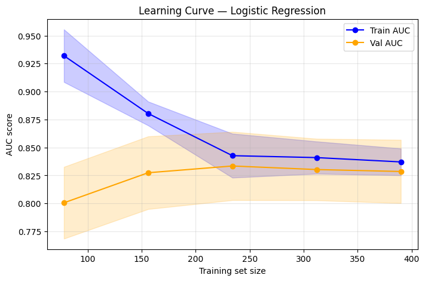

## Bias-Variance Tradeoff — Decision Tree

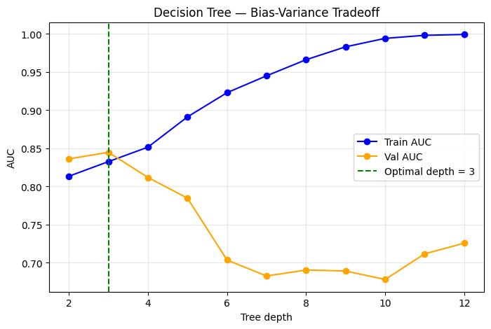

## OOB Score vs Tree Count — Random Forest

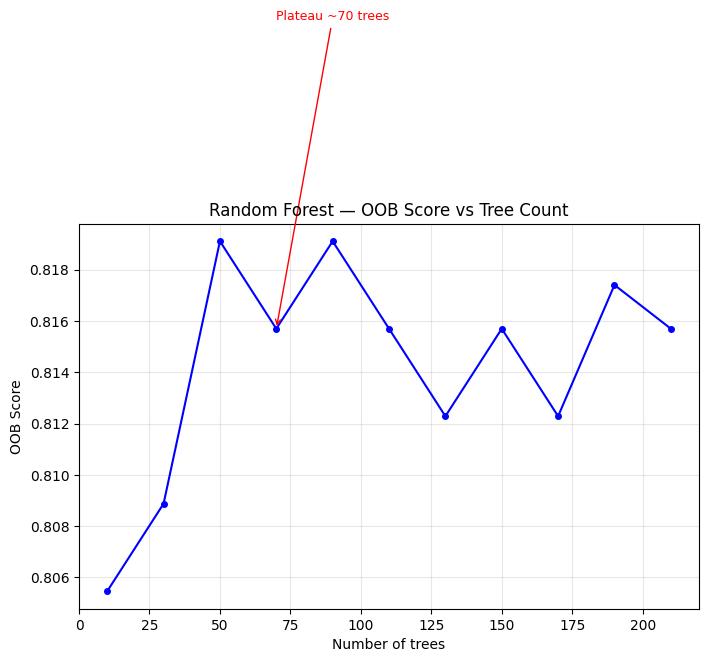

## Optuna Optimisation History — XGBoost

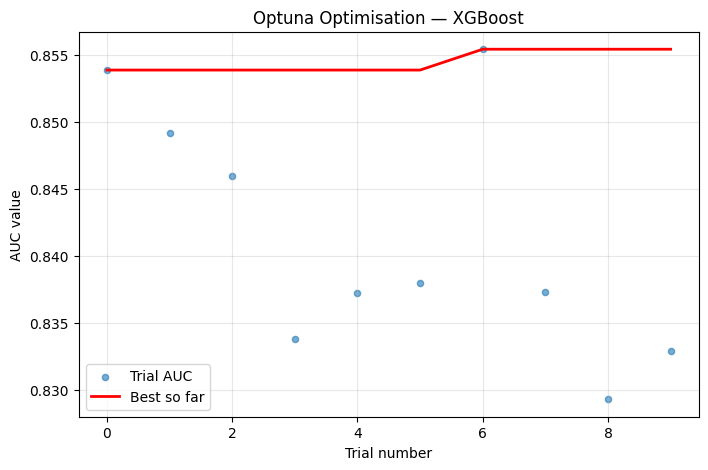

## Calibration Curve — Selected Model

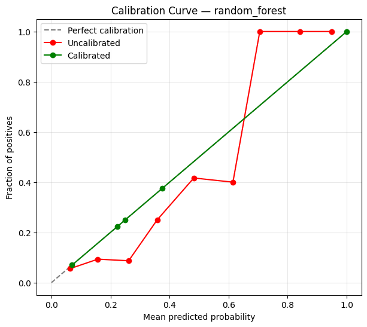

## SHAP Feature Importance — Selected Model

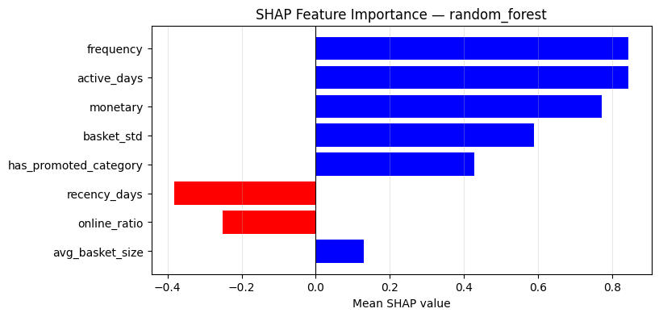

## Realised Lift by Propensity Decile

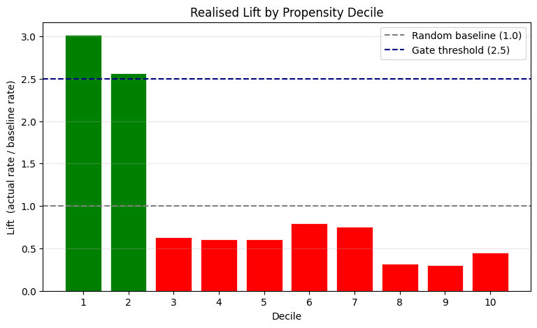

## PSI Drift Heatmap — Feature Stability (8 weeks)

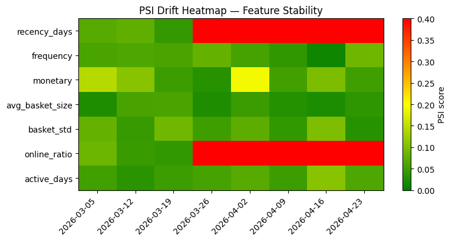

## Customer Segment Profiles

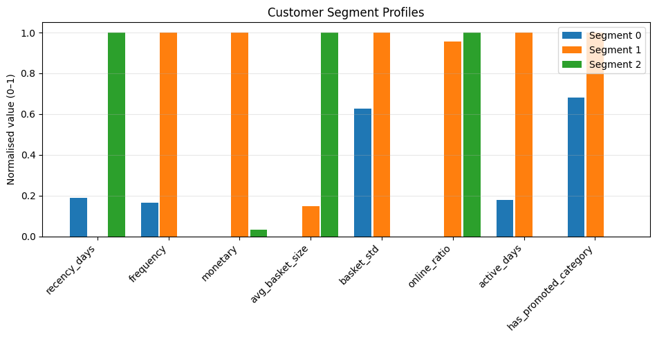

## 7-Model AUC Comparison

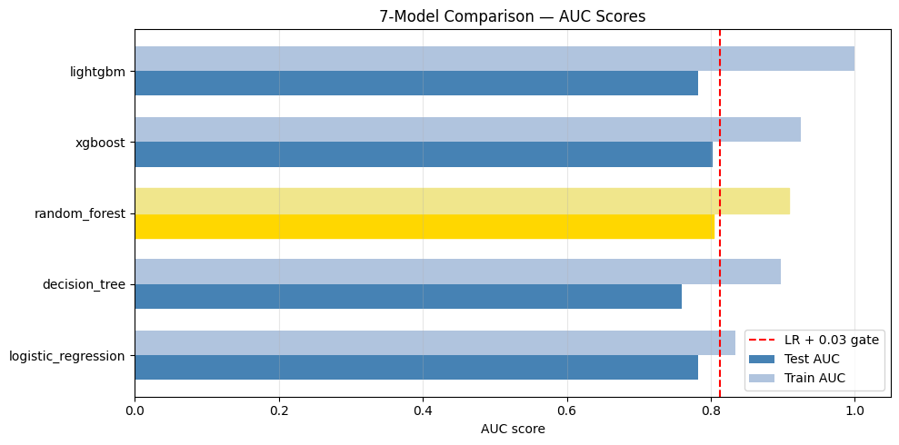

## XGBoost — Train vs Val Loss per Boosting Round

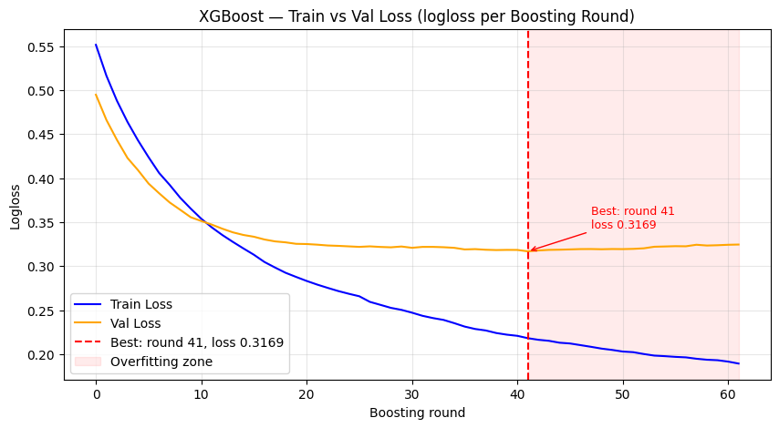

## LightGBM — Train vs Val Loss per Boosting Round

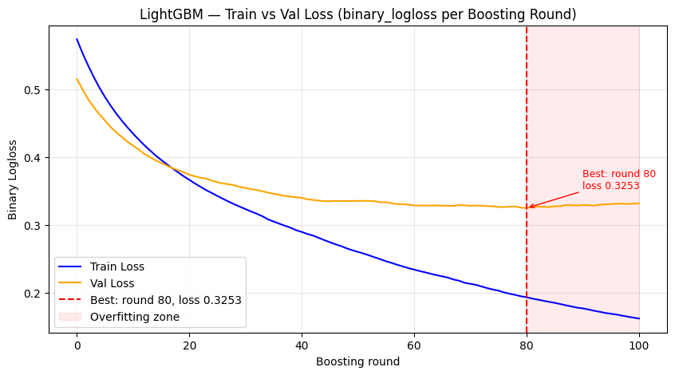

## All Models — Bias-Variance Diagnosis

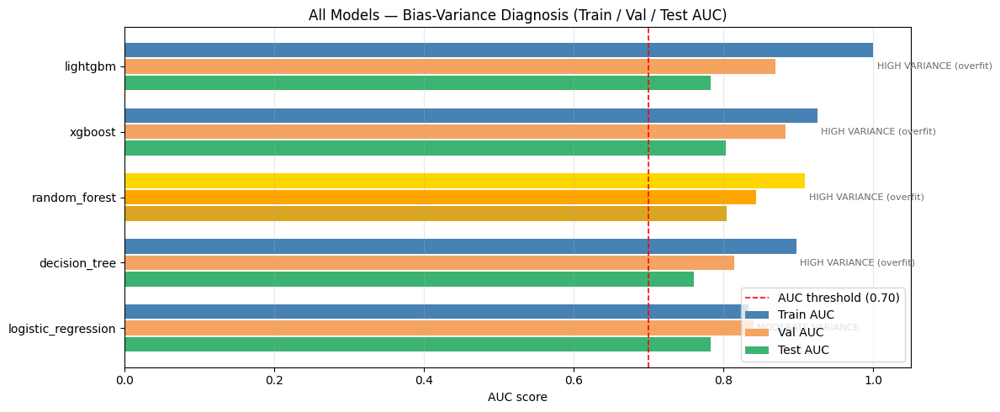

## Learning Curves — Bias-Variance Comparison Across Models

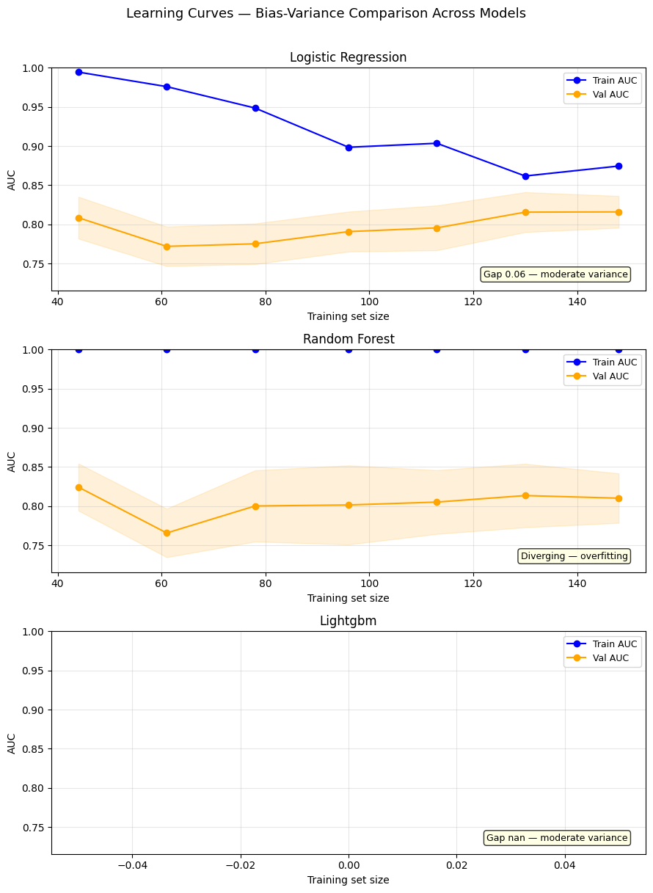
